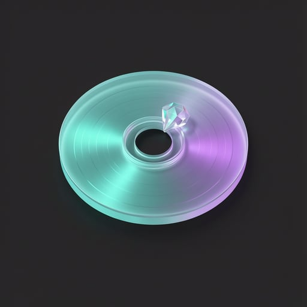

<div align="center">



# ⚡ StorageRelief (Python Edition)

**Next-Gen Windows Storage Optimizer & Duplicate Hunter**  
*Reclaim 20 GB to 100+ GB of hidden bloatware, obsolete app versions, GPU shader caches, and duplicate files with a single click.*

[](https://www.python.org/)
[](https://pywebview.flowrl.com/)
[](https://microsoft.com)
[](LICENSE)
[](SECURITY.md)

<br/>

> 📦 **Instant Ready-to-Run Downloads (No Python Required):**
> - 🚀 [**`StorageRelief.exe`**](StorageRelief.exe) — **Portable Single Executable (~39 MB)**, run immediately anywhere.
> - 💻 [**`StorageRelief_Setup.exe`**](StorageRelief_Setup.exe) — **Windows Setup Installer (~40 MB)** with Desktop shortcut, Start Menu entry, and clean uninstaller.

</div>

---

## 💡 The Problem StorageRelief Solves

Traditional cleaners (such as Windows Disk Cleanup or CCleaner) only touch standard browser cookies and system temp folders, typically freeing a meager 500 MB to 2 GB. Meanwhile, modern applications leave behind massive gigabytes of hidden waste:

- **Ghost App Versions:** Auto-updating software (CapCut, Discord, Slack, Postman, Figma) silently keeps 5–20 GB of dead prior version builds in `AppData\Local`.
- **Media & Gaming Caches:** GPU shader pre-caches (**NVIDIA DXCache/GLCache**, DirectX D3DSCache, AMD), Steam HTML caches, Epic Games, and DaVinci Resolve render caches quietly swell to 10–30 GB.
- **Web Browser Deep Storage:** Chrome, Edge, Brave, and Firefox retain gigabytes of stale script caches, shader caches, and media fragments.
- **Developer Package Artifacts:** Rebuildable `pip\cache`, `uv\cache`, `npm-cache`, and `.gradle\caches` balloon continuously.
- **System Telemetry & Crash Dumps:** Accumulated memory dumps and Windows Error Reporting archives occupying prime SSD space.
- **Silent Duplicates:** Identical high-res photos, videos, and multi-gigabyte zip files scattered across downloads and documents.

**StorageRelief combines a deep storage crawler with a cryptographic duplicate hunter to reclaim your storage safely and swiftly.**

---

## ✨ Features

### 1. 🧹 Deep Storage Scanner (7 Dedicated Categories)
| Category | What It Targets | Default Selection | Safety Level |
|---|---|:---:|:---:|
| **Ghost Apps** | Dead prior version builds from CapCut, Discord (`app-*`), Slack, Postman, Figma, and Squirrel `.nupkg` packages | ✅ Selected | `Safe` |
| **Media & Gaming** | NVIDIA DXCache/GLCache, AMD caches, Steam HTML & package downloads, Spotify offline caches, Adobe/DaVinci media | ✅ Selected | `Safe` |
| **Browser Caches** | Chrome, Microsoft Edge, Brave, Firefox, and Opera deep page & GPU caches | ✅ Selected | `Safe` |
| **Caches & Temp** | Pip, UV, npm, Gradle build caches, and Windows user temp directories | ✅ Selected | `Safe` |
| **System Bloat** | Application crash dumps (`AppData\Local\CrashDumps`), Windows Error Reporting archives, delivery optimization | ✅ Selected | `Safe` |
| **Dev Junk** | Discovered `node_modules`, `.venv`, and build artifacts | ⚠️ Contextual | `Review` |
| **Virtual Disks** | Heavy `.iso`, `.zip`, `.msi` installers and virtual hard disks | ❌ Unchecked | `Caution` |

### 2. 🔍 Cryptographic Duplicate Hunter
- **Multi-Threaded Deduplication Engine:** $O(1)$ size grouping $\to$ fast 64 KB block hashing $\to$ full-file cryptographic hash validation.
- **Smart Original Preservation:** Automatically locks the oldest original file in safe green while pre-selecting newer duplicate clones for 1-click removal.
- **Interactive File Cards:** Shows matched duplicate groups with side-by-side timestamps, exact file paths, and thumbnail badges.

### 3. 💽 Hardware-Aware Multi-Drive Selector
- **Native Win32 Discovery:** Interrogates NVMe/SSDs, hard drives, and removable USB storage via `GetLogicalDrives`, `GetDriveTypeW`, and `GetDiskFreeSpaceExW`.
- **Live Drive Metrics:** Dynamic capacity gauge with proportional used/free breakdown and instant drive hot-switching.

### 4. 🎨 Fluent Holographic Glassmorphic Interface
- **Pure Vector & Modern Typography:** Curated Plus Jakarta Sans and JetBrains Mono with zero emoji clutter.
- **Iridescent Holographic Theme:** Tailored color palette derived from frosted optical glass (radiant mint `#2dd4bf` and amethyst lilac `#c084fc`).
- **Responsive Layout:** Fluidly scales across all displays from 1366×768 laptops to 4K ultra-wide monitors.

---

## 🔒 Safe Deletion Architecture

StorageRelief operates under strict safety principles:

- **Recursive Attribute Unlocking:** Automatically strips Windows read-only flags before deletion to prevent permission errors on stubborn cache trees.
- **NTFS Loop Guard:** Verifies directory reparse points (`FILE_ATTRIBUTE_REPARSE_POINT`) to prevent infinite traversal across Windows junction points.
- **Pre-Clean Explorer Inspection:** Every discovered item features a direct **"Open in File Explorer"** button so you can verify folder contents before confirming.
- **Itemized Confirmation Modal:** Cleanups require explicit confirmation and display the exact list of targets and calculated byte reclaim values.
- **100% Offline:** Operates strictly on your local PC with zero telemetry or network calls.

---

## 🚀 Quick Start (Run from Source)

### Prerequisites
- Python 3.10 or higher
- Windows 10 or 11 (Microsoft Edge WebView2 is built into Windows)

### 1. Clone & Setup
```powershell
# Clone the repository
git clone https://github.com/YOUR_USERNAME/StorageRelief-Python.git
cd StorageRelief-Python

# Install required dependencies
pip install -r requirements.txt
```

### 2. Launch the Application
```powershell
# Launch Edge WebView2 GUI
python main.py

# Or use one-click launch scripts:
.\run.bat
# or
.\run.ps1
```

*(Optional) To launch the native Qt6 interface instead: `python main_qt.py`*

---

## 🛠️ Building Releases

You can compile standalone binaries using the included build pipeline:

```powershell
powershell -NoProfile -ExecutionPolicy Bypass -File .\build.ps1
```
This automatically produces:
1. **`StorageRelief.exe`**: Portable standalone single executable via PyInstaller.
2. **`StorageRelief_Setup.exe`**: Complete Windows setup installer via Inno Setup 6.

---

## 📁 Repository Structure

```
StorageRelief-Python/
├── assets/
│   ├── icon.ico            # Windows multi-resolution icon (16px to 256px)
│   └── icon.png            # Master 512x512 holographic disc logo
├── core/
│   ├── __init__.py
│   ├── scanner.py          # Deep scanner (GPU/media, browsers, ghost apps, system bloat)
│   ├── cleaner.py          # Resilient deletion engine & Windows permission unlocker
│   └── duplicates.py       # Multi-threaded cryptographic duplicate finder
├── ui/
│   └── web/                # Edge WebView2 frontend
│       ├── index.html      # Responsive dashboard layout
│       ├── styles.css      # Harmonized dark glassmorphism design system
│       ├── main.js         # JavaScript-to-Python IPC bridge and UI state
│       └── assets/         # Web favicons and brand images
├── .github/workflows/      # Automated CI/CD release workflow
├── installer.iss           # Inno Setup 6 compiler configuration
├── build.ps1 / build.bat   # Dual release packaging scripts
├── run.ps1 / run.bat       # One-click startup scripts
├── StorageRelief.exe       # Pre-compiled standalone portable executable
├── StorageRelief_Setup.exe # Pre-compiled Windows setup installer
├── requirements.txt        # Minimal Python dependencies
├── CONTRIBUTING.md         # Developer & contribution guidelines
├── SECURITY.md             # Security and safe deletion policy
└── LICENSE                 # MIT License
```

---

## 📄 License

This project is licensed under the [MIT License](LICENSE) — free for personal, educational, and commercial use.
